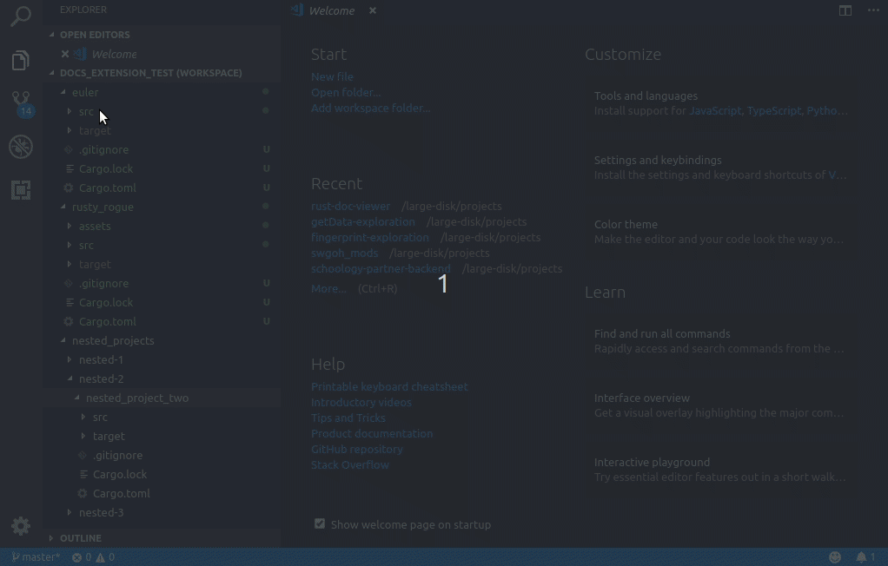

# rust-doc-viewer

This extension will take your locally generated project docs and display them in a new window for easier reference.

## Use

* Create the documentation using `cargo doc` inside of your project folder
* Open the folder in VS Code
* Open the Command Palette `Ctrl+Shift+P` or `Cmd+Shift+P`
* Search and activate `Rust: Doc Viewer`

## Features

Open your rust docs and view them in another tab on VS Code

## Known Issues

    1.) No easy navigation

    2.) Requires documentation to be in the standard output from `cargo docs` 

    3.) Testing and build automation

## Upcoming changes

## Release Notes

### 1.0.6
- List rust folders with rust standard structure
- Open multiple Rust docs per workspace (i.e. a workspace with multiple Rust projects)

### 1.0.5
- `vscode` dependencies contained a vulnerability. Updated package to latest with no gulp dependency
- `js-yaml` contained vulnerabilities. Updated via `npm audit fix`
- Add ability to handle untitled workspaces

### 1.0.4

- Add icon and update banner

### 1.0.3

- Remove configuration until it can be used and is fully functional
- Fix nested navigation path resolution

### 1.0.2

- Update README with more setup information

### 1.0.1

- Fix issue finding generated docs

### 1.0.0

- Initial release of Rust Doc Viewer
